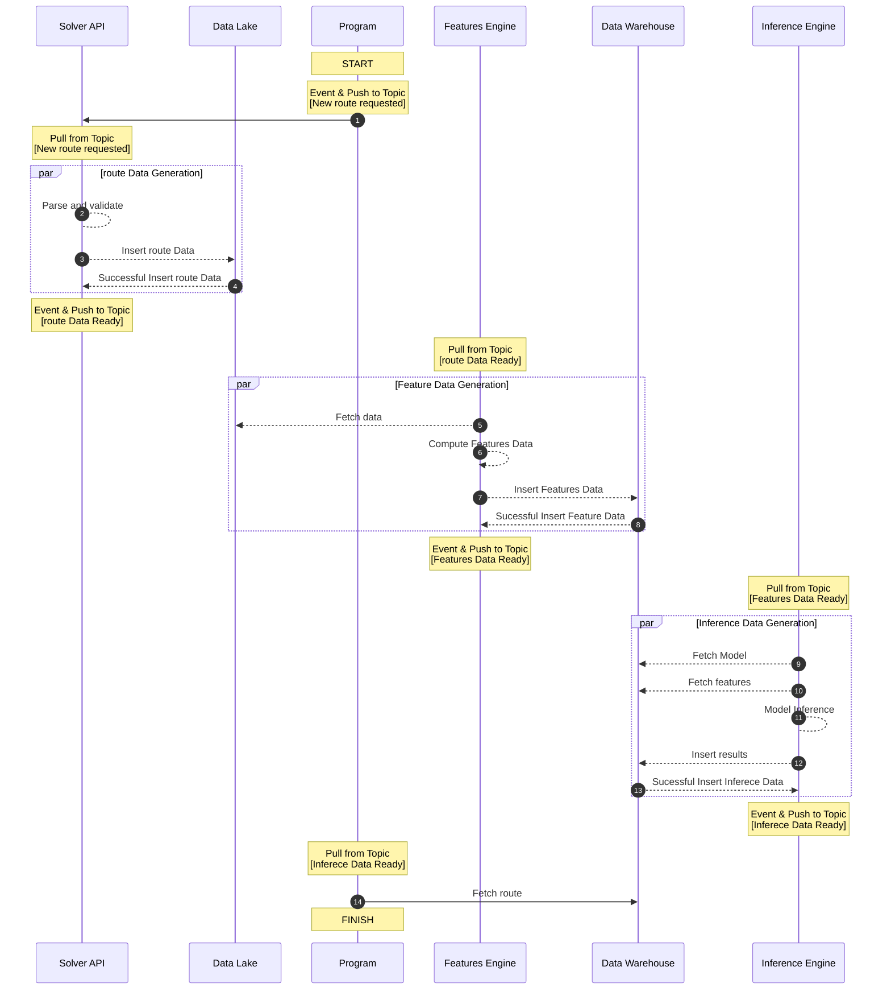

# infrastructure

Workflow for the deployment and generation of forecasted signals (Inference Engine), and, Execution Route (Solver API)

## Software Design Paradigm

- Paradigm: Event-Driven
- Taxonomy: Many-to-Many

## Components and actions

- **Solver-API** is the Route Generator: Producer and Consumer.
- **Program** is the Route Requester: Producer and Consumer.
- **a GCP Function** as the Features Engine: Producer and Consumer.
- **a GCP Function** as the Inference Engine: Producer and Consumer.
- **a GCP Pub/Sub** as the Communication Protocol: Channel.
- **a GCP Cloud SQL** as the Data Lake: Producer.
- a **GCP Cloud SQL** as the Data Warehouse: Producer.

## Events 

### Main Functionality

- **route_request**:
    - **trade_route**: The request to produce the route for a trade to be executed by **Program**.
- **route_data**:
    - **generation_ok**: a stafisfactory data internal generation and/or external retrieval, in this case by **Solver-API**.
    - **insertion_ok**: a satisfactory response gathered by the Process, in this case **Solver-API**.
    - **existence_ok**: existence of the full and correct data by the DB, in this case **Data-Lake**.
- **features_data**: 
    - **generation_ok**: a stafisfactory data internal generation, in this case by **Features-Engine**.
    - **insertion_ok**: a satisfactory response gathered by the Process, in this case **Features-Engine**.
    - **existence_ok**: existence of the full and correct data by the DB, in this case **Data-Warehouse**.
- **inference_data**:
    - **generation_ok**: a stafisfactory data internal generation, in this case by **Inference-Engine**.
    - **insertion_ok**: a satisfactory response gathered by the Process, in this case **Inference-Engine**.
    - **existence_ok**: existence of the full and correct data by the DB, in this case **Data-Warehouse**.

### Logs and Monitoring

- **log**:
    - **DEBUG**: Free to use for development purposes.
    - **INFO**: Constant info for validation/branching/structuring data sets.
    - **WARNING**: A non-critical error.
    - **SYSTEM_ERROR**: A systems error. 
    - **PROCESS_ERROR**: A modeling process error. 
    - **CRITICAL**: A unavoidable and urgent error to be fixed.

## Events schemas

- **Names**: {route_request, route_data, features_data, inference_data}.
- **Payload**: {trade_route, generation_ok, insertion_ok, existence_ok}

## Routings

- topic for route : **topic_route_events**
- topic for logs : **topic_route_logs**

## Ancillary code

- **topic_publish.py** : A script to manually publish a message into an existing Pub/Sub topic.
- **data_io.py** : A script to read/write data from and into both the Data Lake and the Data Warehouse.
- **synthetic_data.py** : A script to create random content that follows the correct expected schema (both for the DL and DW).
- **data_catalog.json** / **features_catalog.json** / **models_catalg.json** : Schemas for each case

## Error Handling

### Input Data Stage

- **Program** fails to push to route topic a new_route message: 
    - Dead letter Queue : Do a 10x re-try cycle.
    - Alternative: Run a manual script to push to topic.
- **Solver-API** fails to pull from the route topic the new_route message:
    - Do a 10x re-try cycle.
    - Alternative: Use a script to manually trigger process::{route Data Generation}
 
- **Solver-API** fails to parse and validate route_data:
    - Use a script to manually create data.
- **Solver-API** fails to insert route_data fully or partially into Data Lake:
    - Do a 3x re-try cycle
    - Alternative: Use a script to manually insert data into Data Lake.
- **Solver-API** fails to push to route topic the route_data message:
    - Dead letter queue: Do a 10x re-try cycle.
    - Alternative: Run a manual script to push to topic.

###  Feature Stage

- **FEATURES ENGINE** fails to pull from route topic the route_data message:
    - Do a 3x re-try cycle
    - Alternative: Use a script to manually read the data from Data Lake.
- **FEATURES ENGINE** fails to generate values:
    - Alternative: Use a script to manually generate data.
- **FEATURES ENGINE** fails to insert features_data:
    - Do a 3x re-try cycle
    - Alternative: Use a script to manually insert data into the Data Warehouse.
- **FEATURES ENGINE** fails to push to route topic the features_data message:
    - Dead letter Queue : Do a 10x re-try cycle.
    - Alternative: Run a manual script to push to topic.

### Inference Stage

- **INFERENCE ENGINE** fails to pull from route topic the features_data message:
    - Do a 3x re-try cycle
    - Alternative: Use a script to manually read data from Data Warehouse.
- **INFERENCE ENGINE** fails to generate values:
    - Alternative: Use a script to manually generate data.
- **INFERENCE ENGINE** fails to insert inference_data:
    - Alternative: Use a script to manually insert data to Data Warehouse.	
- **INFERENCE ENGINE** fails to push to route topic the inference_data message:
    - Dead letter Queue : Do a 10x re-try cycle.
    - Alternative: Run a manual script to push to topic.

### Final Data Stage

- **Program** fails to pull from route topic the inference_data message:
    - Dead letter Queue : Do a 10x re-try cycle
    - Alternative: Run a manual script to read from Data Warehouse.

### Storage, retention, access 

- Inmediate: Entries in table of Logs and Metrics Database
- Archive: Grouped in zipped file. 

### Monitoring and Alerts

Grafana and its alerting systems (Slack/Email/SMS)

- Dashboard for logs aggregation and visualization.
- Alerting system for critical events.

